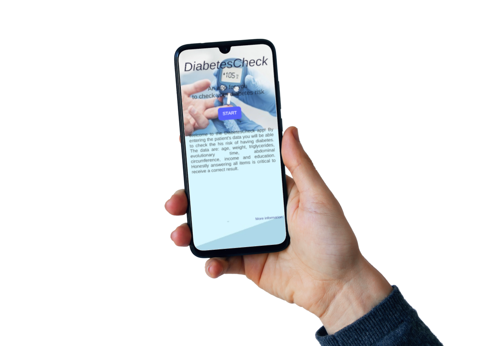
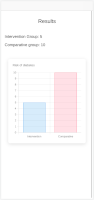
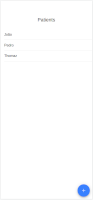
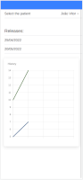

# AppDiabetesCheck

[](https://github.com/IsabelaCJesus/frontendAppDiabetesCheck/tags)
[](#licença)



## | [Como usar](#como-usar) | [Distribuições](#distribuições) | [Como contribuir](#como-contribuir) | [Como desenvolver](#como-desenvolver) | [Sobre](#sobre) | [Licença](#licença) |


Bem-vindo ao aplicativo DiabetesCheck! Ao inserir os dados do paciente, você poderá verificar o risco dele de ter diabetes. Os dados são: idade, peso, triglicerídeos, tempo evolutivo, circunferência abdominal, renda e escolaridade. Responder honestamente a todos os itens é fundamental para receber um resultado correto.

  

---

### Como usar
  - Caso possua uma conta, logar com ela. 
  - Caso não tenha uma, criar uma.
  - Preencher as informações necessárias
  - Analisar os resultados

---

### Distribuições
<a href='https://play.google.com/store/apps/details?id='></a>
<a href='https://appstore.com'></a>

---

### Como Contribuir
<a href="https://www.paypal.com/cgi-bin/webscr?cmd=">
 
</a>

---

### Como desenvolver
1. Realize um fork do repositório

2. Compondo a mensagem do commit
> Cabeçalho: Explique esse commit em uma linha (Use a linguagem imperativa)

> O corpo da mensagem de commit são algumas linhas de texto, explicando em mais detalhes e possivelmente apresentando mais contexto sobre o problema sendo tratado.
> O corpo da mensagem de commit pode ser diversos paragráfos e por favor façam corretamente a quebra de linha e mantenham as colunas menos  que 74 caracteres. Assim, o comando "git log" irá mostrar a mensagem de forma agradável mesmo que esteja identada.

> Faça questão de explicar a sua solução e por que voce está fazendo o que está fazendo, ao invés de apenas descrever o que está fazendo de forma superficial. Pense que revisores e o seu eu-futuro irão ler essas mudanças, mas podem não entender por que determinada solução foi implementada.

> Reported-by: quem-reportou

> Signed-off-by: Seu Nome [email@host.com](mailto:email@host.com)

3. Estrutura mensagem de commit

```
[Cabeçalho]*
[Corpo]
[Rodapé]
```

Os que estão marcados com * são obrigatórios.

**Cabeçalho** terá a seguinte estrutura:

`<tipo>: <descrição>`

Os tipos possíveis serão:

 - _fix_: corrige um bug no seu código.
 - _feat_: adiciona uma nova funcionalidade no seu código.
 - _chore_: Mudanças de configuração ou de código que não entra em produção;
 - _docs_: Mudanças na documentação;
 - _style_: Alteração apenas no estilo do código, sem mudança de algoritmo;
 - _refactor_: Refatoração de determinado bloco de código;
 - _perf_: Alterações que impactam o desempenho da aplicação;
 - _test_: Mudanças na estrutura ou na forma de testar o projeto.

**Corpo**: Uma descrição do que foi feito no commit

**Rodapé**: Identificará a issue na qual este commit se refere, ou se é uma grande mudança no código.

#### Executar aplicação
Instale as dependências usando o comando:
`npm i`

Configurar as variáveis API_URL, que é variável do host do backend, que se encontra nos arquivos:
 - email.service.ts
 - launch.service.ts
 - patient.service.ts
 - user.service.ts

O backend do projeto está localizalizado [neste repositório](https://github.com/IsabelaCJesus/diabetes-spring).

##### Executar modo desenvolvimento
`npm run start`

##### Executar os testes
`npm run test`

##### Build
`npm run build`

##### Executar via docker
> Tem que criar ainda

---

### Sobre
Tendo em visto que a quantidade de pessoas que estão desenvolvendo diabetes é alta e que no Brasil esta é uma das doenças que mais dão gastos públicos. O aplicativo tem o objetivo de auxiliar os pacientes a saberem seu risco de desenvolver diabetes, para que os que tiverem risco mais altos, possam correr atrás de alternativas para diminuir esse, procurar um profissional para que ele possa ajudá-lo com esta situação e se necessário já começar um tratamento, para que eles possam diminuir seu risco. 

Informando alguns dados como idade, seu pesoa, o número de triglicerídeos no seu organismo, tempo evolutivo, a circuferência abdominal, renda e o grau de escolaridade, o aplicativo será capaz de entregar um resultado dizendo quais são os riscos da pessoa de desenvolver diabetes. 

---

### Tecnologias Utilizadas

|nome |versão|
|:---:|:----:|
|ionic| ^6.0.0  |
|angular| ~13.2.2  |
|firebase| ^9.8.1 |

---

## Legal

O fabricante deste software não assume nenhuma responsabilidade pela atualidade, exatidão, integridade ou qualidade das informações fornecidas. Excluem-se as reclamações de responsabilidade contra o fabricante pelo uso ou não uso do software.

### Licença

```
The MIT License (MIT)

Copyright (c) 2022-present Isabela Jesus

Permission is hereby granted, free of charge, to any person obtaining a copy
of this software and associated documentation files (the "Software"), to deal
in the Software without restriction, including without limitation the rights
to use, copy, modify, merge, publish, distribute, sublicense, and/or sell
copies of the Software, and to permit persons to whom the Software is
furnished to do so, subject to the following conditions:

The above copyright notice and this permission notice shall be included in all
copies or substantial portions of the Software.

THE SOFTWARE IS PROVIDED "AS IS", WITHOUT WARRANTY OF ANY KIND, EXPRESS OR
IMPLIED, INCLUDING BUT NOT LIMITED TO THE WARRANTIES OF MERCHANTABILITY,
FITNESS FOR A PARTICULAR PURPOSE AND NONINFRINGEMENT. IN NO EVENT SHALL THE
AUTHORS OR COPYRIGHT HOLDERS BE LIABLE FOR ANY CLAIM, DAMAGES OR OTHER
LIABILITY, WHETHER IN AN ACTION OF CONTRACT, TORT OR OTHERWISE, ARISING FROM,
OUT OF OR IN CONNECTION WITH THE SOFTWARE OR THE USE OR OTHER DEALINGS IN THE
SOFTWARE.
```
